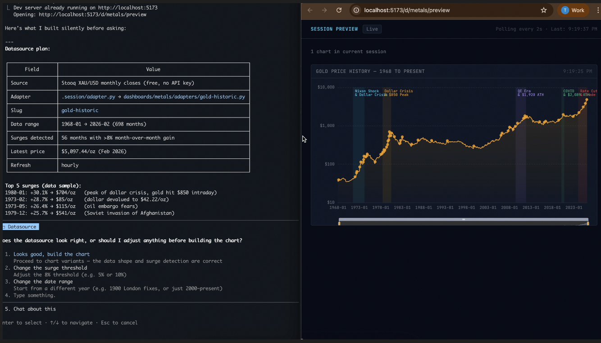
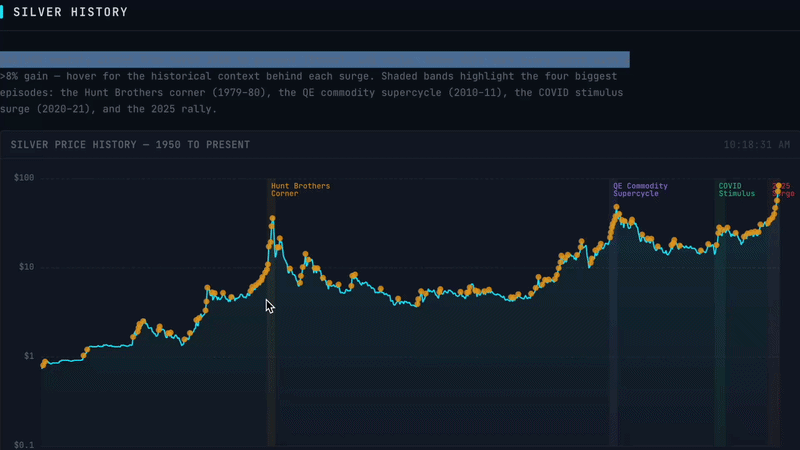

# Dashboard Agent

A multi-dashboard data visualization platform powered by Claude Code. This project explores the boundaries of the shift toward agentic software, where AI agents are no longer just assistants, but act as the runtime environment for interactive programs.



While the example prompt below represents a fairly common dataset use case, the system has also been tested with users who have much more niche data requirements: including bio-tech researchers exploring relationships between diseases, social workers attempting to retrieve region-specific datasets, and demographic analysis for small municipalities.

In addition to sourcing public datasets (e.g. government portals, PDFs, or structured web content), the platform can also integrate with existing data infrastructure. During testing, this included successfully connecting to both an SQLite database and AWS Athena to retrieve and visualize proprietary or internal datasets.

## Getting Started

```bash
# Clone repo
git clone git@github.com:tobrun/dashboard-agent.git

# Change directory and install deps
cd dashboard-agent && npm install && pip install -r requirements.txt

# Start server: http://localhost:5173
./bin/start

# Open Claude
claude
```

Prompt Claude to create a dashboard and scope out your first graph:

```bash
Create precious metals dashboard. Plot historic silver price, highlight 8% increases and annotate why the surge happened.
```



Claude first determines where the required data can be sourced from.

- If an API is available, it will attempt to retrieve the data
  directly.
- Otherwise, it will explore alternative methods such as
  scraping public websites (e.g. government portals) or extracting
  structured information from documents like PDFs.
- You can also connect a database by providing access instructions,
  Claude will use these to retrieve the relevant data.

Once a data source has been identified, Claude generates Python-based
adapters that normalize the data and export it as JSON files under
`/data`.

This data is then exposed via the `/preview` endpoint, where multiple
graphs are automatically generated for inspection. From there, you can
choose which visualizations should be included in the final dashboard.
